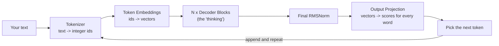
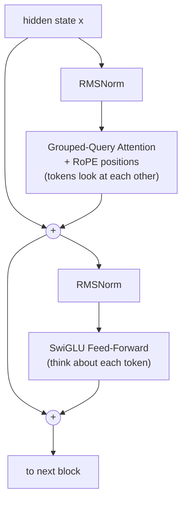

# The Illustrated Llama-Based Decoder &mdash; Understand How LLMs Work

> **The goal of this repo is simple: help you *actually understand* how a modern Large
> Language Model works** &mdash; not by hand-waving, but by building one from scratch, piece by
> piece, in plain **PyTorch**, with pictures, intuition, and runnable code at every step.

If you have ever wondered *"what is really happening inside an AI that writes text?"*, this is
for you. We build a complete **Llama-based decoder** (the architecture behind most modern open
LLMs) small enough to run on a laptop and print every tensor, yet structurally identical to the
billion-parameter models in production. Only the numbers get bigger.

---

## The one-sentence idea behind every LLM

> An LLM is a function that, given a sequence of tokens, predicts the **next token** &mdash;
> and you generate text by doing that over and over.

That's it. Everything else is engineering to make that prediction accurate and fast.


*The model predicts one token, appends it to the input, and repeats. This loop is called **auto-regression**.*

---

## How an LLM works, in one picture



The model never sees letters &mdash; it sees numbers. Words become **ids**, ids become
**vectors**, a stack of **decoder blocks** refines those vectors, and a final layer turns them
into a probability for **every word in the vocabulary**. We sample one, glue it on, and loop.

---

## What happens inside one "decoder block"

The decoder block is where the real work happens, and the whole model is just this block
stacked `N` times. Each block does two things, each protected by a **residual connection**
(a shortcut that adds the input back, so deep stacks train without the signal getting lost):



1. **Attention** &mdash; lets each token *gather information from the tokens before it*
   (e.g. resolving what "it" refers to).
2. **Feed-forward** &mdash; lets the model *process each token individually* and store knowledge.

---

## The mental model of attention (the heart of it all)

Every token creates three vectors. A useful analogy is searching a filing cabinet:

| Vector | Role | Analogy |
|---|---|---|
| **Query** | what I'm looking for | the sticky note with your search topic |
| **Key** | what I advertise about myself | the label on each folder |
| **Value** | the information I hand over | the contents inside the folder |

Each token's **query** is matched against every **key** (a dot product) to get scores; a
**softmax** turns scores into weights; the output is the weighted blend of **values**. A
**causal mask** blocks every token from peeking at the future &mdash; that's what makes it a
*language* model.

---

## The key ingredients we build

These are the core building blocks of the architecture. Each one is explained from scratch
&mdash; intuition, math, code, and a picture &mdash; in the notebook.

| Ingredient | What it does |
|---|---|
| **Token embeddings** | turn each token id into a learnable vector |
| **RMSNorm** | keep activations at a stable scale so the network trains smoothly |
| **RoPE (Rotary Position Embeddings)** | tell the model *where* each token is, by rotating vectors |
| **Grouped-Query Attention (GQA)** | let tokens share information efficiently with a small memory footprint |
| **SwiGLU feed-forward** | a gated network that processes and stores knowledge per token |
| **Residual connections** | shortcuts that make very deep stacks trainable |

---

## Your learning path: `Transformer_llama_based_decoder.ipynb`

Read it top to bottom. Every section follows the same rhythm: **picture &rarr; intuition
&rarr; math &rarr; PyTorch code &rarr; runnable example with output**.

| # | Section | You'll learn |
|---|---|---|
| 0 | Tiny configuration | the knobs of a model (`dim`, heads, layers, ...) |
| 1 | The big picture | how blocks stack into a model |
| 2 | Token embeddings | turning ids into vectors |
| 3 | **RMSNorm** | how activations are kept stable (with a visual) |
| 4 | **RoPE** | encoding *position* by rotation (with 3 visuals) |
| 5 | Self-attention + masking | how tokens talk to each other |
| 6 | **Grouped-Query Attention** | the efficiency trick (with a diagram) |
| 7 | **SwiGLU** | the gated feed-forward (with an activation plot) |
| 8 | The decoder block | assembling one full block |
| 9 | The full model | stacking it all (with real attention maps) |
| 10 | Generation | producing text, and a tiny training run that *proves it learns* |

---

## Run it yourself

The notebook is already executed with all outputs and plots embedded, so you can simply read
it on GitHub. To run and experiment:

```bash
python -m venv .venv && source .venv/bin/activate
pip install torch matplotlib numpy jupyter
jupyter notebook Transformer_llama_based_decoder.ipynb
```

Illustrations and GIFs live in `./image`.

---

## Who is this for?

- **Beginners** who know a little Python and want to demystify LLMs.
- **ML engineers** who use these models and want to understand the internals.
- **Students & educators** looking for a clear, visual, end-to-end reference.

**Prerequisites:** basic Python and a rough idea of what a neural network is. No prior
Transformer knowledge required &mdash; we build everything up from zero.
